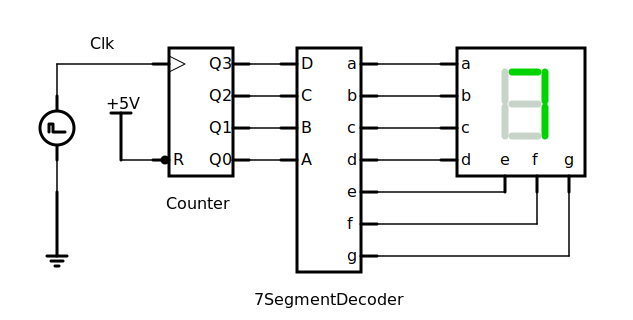

## 完整电路图




## 计数器

```verilog
module counter(
    clk,
    rst,
    count
);
input           clk, rst;
output [3:0]    count;

reg[3:0]        temp;
wire[3:0]       count;
assign count = temp;
always @(posedge clk or negedge rst) begin
    if(~rst) begin
        temp <= 0;
    end
    else begin
        temp <= temp + 1;
    end
end
endmodule
```


## BCD七段译码器

```verilog
// BCD7段译码器
module segment_decoder(
    num,
    rst,
    a_g
);
input [3:0] num;
input rst;
output [6:0] a_g; // a_g[6:0]->a,b,c,d,e,f,g

reg [6:0] temp;
wire [6:0] a_g;
assign a_g = temp;
always @(num or rst) begin
    if (rst) begin
        temp<=7'd0;
    end
    else begin
        case(num)
            4'd0:    temp<=7'b111_1110; // a,b,c,d,e,f
            4'd1:    temp<=7'b011_0000; // b,c
            4'd2:    temp<=7'b110_1101; // a,b,d,e,g
            4'd3:    temp<=7'b111_1001; // a,b,c,d,g
            4'd4:    temp<=7'b011_1011; // b,c,d,f,g
            4'd5:    temp<=7'b101_1011; // a,c,d,f,g
            4'd6:    temp<=7'b101_1110; // a,c,d,e,f,g
            4'd7:    temp<=7'b111_0000; // a,b,c
            4'd8:    temp<=7'b111_1111; // a,b,c,d,e,f,g
            4'd9:    temp<=7'b111_1011; // a,b,c,d,f,g
            default: temp<=7'b000_0001; // g
        endcase
    end
end
endmodule
```


